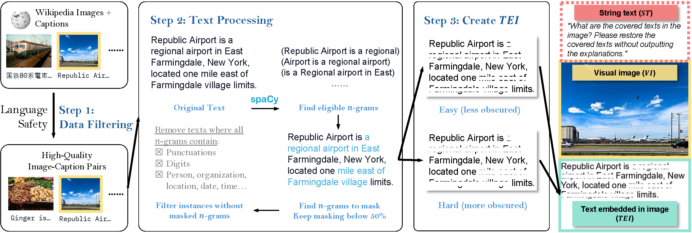

# VCR: 视觉字幕恢复

[Tianyu Zhang†](https://ai.t-zhang.com), [Suyuchen Wang†](https://github.com/sheryc), [Lu Li](https://sites.google.com/view/meetluli/home), [Ge Zhang](https://scholar.google.com/citations?user=qyTrq4kAAAAJ), [Perouz Taslakian](https://perouz.github.io/), [Sai Rajeswar](https://sairajeswar.com/), [Jie Fu](https://bigaidream.github.io/), [Bang Liu](https://www-labs.iro.umontreal.ca/~liubang/), [Yoshua Bengio](https://yoshuabengio.org/)

† 共同第一作者

<div align="center">

[](https://arxiv.org/abs/2406.06462)
[](https://huggingface.co/collections/vcr-org/vcr-visual-caption-recognition-6661393b1761e2aff7b967b9)
[](https://huggingface.co/collections/vcr-org/vcr-visual-caption-restoration-smaller-test-subsets-6667b591329b67db9408b493)
</div>

[English Readme](README.md)

<div align="center">
  
</div>


# 新闻
- 🔥🔥🔥 **[2024-06-24]** 我们更新了我们的 arXiv 论文。现在，我们有来自 Claude 3.5 Sonnet、Claude 3 Opus、GPT-4o、GPT-4-Turbo、Qwen-VL-Max、Reka Core 和 Gemini-1.5-pro 的结果。评估脚本也已发布，请查看 `src/evaluation/closed_source_eval.py`。
- 🔥🔥🔥 **[2024-06-15]** 我们发布了torch框架下的VCR变换，可以为任意图像-文本对生成带有嵌入文本的VCR图像。此变换可作为VLMs中的预训练任务之一。
- 🔥🔥🔥 **[2024-06-13]** 我们发布了开源模型、闭源模型以及创建数据集流程的评估代码。
- 🔥🔥🔥 **[2024-06-12]** 我们已将VCR-wiki评估过程整合到[lmms-eval](https://github.com/EvolvingLMMs-Lab/lmms-eval)框架中。现在用户可以使用一行命令运行模型在VCR-wiki测试数据集上的评估。
- 🔥🔥🔥 **[2024-06-11]** 我们的论文已发布在[arXiv](https://arxiv.org/abs/2406.06462)上，包含了一系列模型的评估结果。
- 🔥🔥🔥 **[2024-06-10]** 我们已发布[VCR-wiki数据集](https://huggingface.co/vcr-org)，该数据集包含来自维基百科的211万英文和34.6万中文实体，提供了易和难两个版本。数据集在Hugging Face Datasets库中可用。

# 快速开始
```bash
pip install datasets
```
```python
from datasets import load_dataset
# 加载英文简单模式数据集
dataset = load_dataset("vcr-org/VCR-wiki-en-easy")
# 加载英文难模式数据集
dataset = load_dataset("vcr-org/VCR-wiki-en-hard")
# 加载中文简单模式数据集
dataset = load_dataset("vcr-org/VCR-wiki-zh-easy")
# 加载中文难模式数据集
dataset = load_dataset("vcr-org/VCR-wiki-zh-hard")

for obs in dataset['train']: # 或 'validation' 或 'test'
    # 在此处编写你的代码
```
## 数据集列表
|  数据集   | 下载链接 |
|  ----  | ----  | 
|  100 测试子集  | <li>[🤗vcr-org/VCR-wiki-en-easy-test-100](https://huggingface.co/datasets/vcr-org/VCR-wiki-en-easy-test-100) <li> [🤗vcr-org/VCR-wiki-en-hard-test-100](https://huggingface.co/datasets/vcr-org/VCR-wiki-en-hard-test-100) <li> [🤗vcr-org/VCR-wiki-zh-easy-test-100](https://huggingface.co/datasets/vcr-org/VCR-wiki-zh-easy-test-100) <li> [🤗vcr-org/VCR-wiki-zh-hard-test-100](https://huggingface.co/datasets/vcr-org/VCR-wiki-zh-hard-test-100)|
|  500 测试子集  | <li>[🤗vcr-org/VCR-wiki-en-easy-test-500](https://huggingface.co/datasets/vcr-org/VCR-wiki-en-easy-test-500) <li> [🤗vcr-org/VCR-wiki-en-hard-test-500](https://huggingface.co/datasets/vcr-org/VCR-wiki-en-hard-test-500) <li> [🤗vcr-org/VCR-wiki-zh-easy-test-500](https://huggingface.co/datasets/vcr-org/VCR-wiki-zh-easy-test-500) <li> [🤗vcr-org/VCR-wiki-zh-hard-test-500](https://huggingface.co/datasets/vcr-org/VCR-wiki-zh-hard-test-500)|
|  5000 (完整) 测试集   | <li>[🤗vcr-org/VCR-wiki-en-easy-test](https://huggingface.co/datasets/vcr-org/VCR-wiki-en-easy-test) <li> [🤗vcr-org/VCR-wiki-en-hard-test](https://huggingface.co/datasets/vcr-org/VCR-wiki-en-hard-test) <li> [🤗vcr-org/VCR-wiki-zh-easy-test](https://huggingface.co/datasets/vcr-org/VCR-wiki-zh-easy-test) <li> [🤗vcr-org/VCR-wiki-zh-hard-test](https://huggingface.co/datasets/vcr-org/VCR-wiki-zh-hard-test)|
|  训练验证测试 (完整) 集    | <li>[🤗vcr-org/VCR-wiki-en-easy](https://huggingface.co/datasets/vcr-org/VCR-wiki-en-easy) <li> [🤗vcr-org/VCR-wiki-en-hard](https://huggingface.co/datasets/vcr-org/VCR-wiki-en-hard) <li> [🤗vcr-org/VCR-wiki-zh-easy](https://huggingface.co/datasets/vcr-org/VCR-wiki-zh-easy) <li> [🤗vcr-org/VCR-wiki-zh-hard](https://huggingface.co/datasets/vcr-org/VCR-wiki-zh-hard)|## 训练和评估数据集

# 介绍
我们呈现了VCR-wiki，这是一个为视觉字幕恢复（VCR）任务设计的数据集。

请参阅下方我们的主要图例，了解VCR任务的概述。

<div align="center">
  
</div>

VCR挑战模型恢复图像内部分被遮挡的文本，利用像素级提示和上下文线索。不同于传统的基于文本的任务，VCR需要对 **视觉图像（VI）**、**字符串文本（ST）** 和 **嵌入图像的文本（TEI）** 进行协同理解与对齐。我们通是通过全自动的方式的合成图像-字幕文本对，其难度可调节。以下展示了创建数据集的，我们将很快发布创建数据集的代码。我们开源了全自动合成合成图像-字幕文本对的脚本以及合成数据集的代码以及torch框架下的VCR变换。这个变换函数可以被用在VLMs的预训练任务中。

<div align="center">
  
</div>

VCR-wiki包含**211万**英文和**34.6万**中文样例，其来源于维基百科。我们提供了易和难两个版本。初步结果表明，当前的视觉语言模型在该任务上与人类表现相比差距明显。

# 模型评估

## 方法1（推荐）：使用评估脚本
### 开源评估
我们支持的开源模型_id:
```python
["openbmb/MiniCPM-Llama3-V-2_5",
"OpenGVLab/InternVL-Chat-V1-5",
"internlm/internlm-xcomposer2-vl-7b",
"HuggingFaceM4/idefics2-8b",
"Qwen/Qwen-VL-Chat",
"THUDM/cogvlm2-llama3-chinese-chat-19B",
"THUDM/cogvlm2-llama3-chat-19B",
"echo840/Monkey-Chat",]
```
对于未在列表中的模型，它们未与huggingface集成，请参考它们的github仓库创建评估流程。

```bash
pip install -r requirements.txt
# 我们以 Hugging FaceM4/idefics2-8b 模型为例
python run_eval.py \
  --model_id HuggingFaceM4/idefics2-8b \
  --data_path datasets/vcr-org/VCR-wiki-en-easy/ \
  --max_new_tokens 20 \
  --image_input_size 256
# 从视觉语言模型 (VLMs) 推断并将结果保存为 {model_id}_{difficulty}_{language}.json
cd src/evaluation
python3 inference.py --dataset_handler "vcr-org/VCR-wiki-en-easy-test" --model_id "HuggingFaceM4/idefics2-8b" --device "cuda" --dtype "bf16" --save_interval 50 --resume True

# 评估结果并将评估指标保存为 {model_id}_{difficulty}_{language}_evaluation_result.json
python3 evaluation_metrics.py --model_id HuggingFaceM4/idefics2-8b --output_path . --json_filename "HuggingFaceM4_idefics2-8b_en_easy.json" --dataset_handler "vcr-org/VCR-wiki-en-easy-test"

# 获取 `jsons_path` 中所有 `{model_id}_{difficulty}_{language}_evaluation_result.json` 的平均分数（如果使用 `--bootstrap`，则会保存标准差以及置信区间）的评估指标
python3 gather_results.py --jsons_path .
```

### 闭源模型评估
我们提供了闭源模型评估脚本，位于 `src/evaluation/closed_source_eval.py`。

你需要一个 API Key、一个预先保存的测试数据集，并指定保存论文数据的路径
```bash
pip install -r requirements.txt
cd src/evaluation
# [下载图片以在本地推理选项1] 使用 huggingface 的脚本将测试数据集保存到指定路径
python3 save_image_from_dataset.py --output_path .
# [下载图片以在本地推理选项2] 使用 github 仓库将测试数据集保存到指定路径
# 以 en-easy-test-500 为例
git clone https://github.com/tianyu-z/VCR-wiki-en-easy-test-500.git

# 如果你想通过本地上传图像推理，请通过 --image_path "path_to_image" 指定图片路径，否则，脚本将从 github 仓库流式传输图片
python3 closed_source_eval.py --model_id gpt4o --dataset_handler "VCR-wiki-en-easy-test-500" --api_key "Your_API_Key"

# 评估结果并将评估指标保存为 {model_id}_{difficulty}_{language}_evaluation_result.json
python3 evaluation_metrics.py --model_id gpt4o --output_path . --json_filename "gpt4o_en_easy.json" --dataset_handler "vcr-org/VCR-wiki-en-easy-test"

# 获取 `jsons_path` 中所有 `{model_id}_{difficulty}_{language}_evaluation_result.json` 的平均分数（如果使用 `--bootstrap`，则会保存标准差以及置信区间）的评估指标
python3 gather_results.py --jsons_path .
```

## 方法二：使用 lmms-eval 框架
如果 lmms-eval 框架不支持您的模型推理方法，您可能需要将其整合进去。详细信息请参考[这里](https://github.com/EvolvingLMMs-Lab/lmms-eval/blob/main/docs/model_guide.md)
```bash
pip install git+https://github.com/EvolvingLMMs-Lab/lmms-eval.git
# 我们以 HuggingFaceM4/idefics2-8b 和 vcr_wiki_en_easy 作为示例
python3 -m accelerate.commands.launch --num_processes=8 -m lmms_eval --model idefics2 --model_args pretrained="HuggingFaceM4/idefics2-8b" --tasks vcr_wiki_en_easy --batch_size 1 --log_samples --log_samples_suffix HuggingFaceM4_idefics2-8b_vcr_wiki_en_easy --output_path ./logs/
```
# VCR Transform 的使用
```python
from vcr_transform import VCRTransform
# "crossed_text" 是可选的，当它为 None 或未提供时，VCRTransform 将自动生成 crossed_text。
example = {
    "image": Image.open("assets/main_pic.png"),
    "caption": "来自全球各地的机器学习研究人员都对新型 GPU 感到兴奋。即使它只有炉灶那么大，其尖端功能也能让大规模实验更高效、更便宜。",
    "crossed_text": [
        "研究人员都对新型 GPU 感到",
        "即使它只有炉灶那么大",
        "尖端功能也能让大规模",
    ],
}
# 以中文的简单模式为例
transform = VCRTransform(mode="easy", language="en") 
transformed_example = transform(example)
```
以下是`VCRTransform`初始化的全部参数列表：

- `--mode`：'easy' 或 'hard' 或 None。若为 'easy'，文本将会在图像中间被划掉。若为 'hard'，文本将会在图像上半部被划掉。若为 None，则会使用参数 mask_mode、mask_p、n_gram、n_lines、language、font_path、font_size、background_color、output_tensor。
- `--mask_mode` (str)：'nouns' 或 'sentence' 或 'percentage' 或 'ngram'。
- `--mask_p` (float)：要划掉的单词百分比。默认为 0.5。
- `--n_gram` (int)：要划掉的子词数。
- `--n_lines` (int)：将文本最多拆分成的行数。默认为 5。
- `--language` (str)：'en' 或 'zh'。
- `--font_path` (str)：渲染图像文本的字体文件路径。
- `--font_size` (int)：渲染图像文本的字体大小。默认为 20。
- `--background_color` (str)：渲染图像文本的背景色。默认为 'white'。
- `--output_tensor` (bool)：是否将图像输出为张量。默认为 False。


# 数据集生成

生成VCR数据集的代码在 `src/dataset` 中。在开始之前，您需要：

1. 包含两列的数据集：`image` 和 `caption`，其中 `image` 包含 PIL.Image 对象，而 `caption` 是相应的标题。
2. 用于在图像上渲染文本的字体文件。在我们的实验中，英文使用 Arial，中文使用 SimSum。
3. （可选）用于初始过滤有害条目的审查词列表。

要生成VCR数据集，您可以运行以下命令：

```bash
cd src/build_dataset
python generate_vcr_dataset.py \
    --dataset_path /path/to/dataset \
    --is_local_dataset True \
    --mask_mode "ngram" \
    --language "en" \
    --font_path /path/to/font \
    --censor_path /path/to/censor \
    --output_dir /path/to/output
```

`generate_vcr_dataset.py` 的所有参数列表如下：
* `--dataset_path`: 原始图像文本对数据集的名称或路径。需要具有 "image" 和 "caption" 列。
* `--is_local_dataset`: 数据集是否存储在本地。如果为True，则脚本将调用 `datasets.load_from_disk()` 来加载数据集。
* `--mask_mode`: 生成VCR数据集的掩码模式之一。可以是 "nouns"、"sentence"、"percentage"、"ngram" 中的一个。默认为 "ngram"。
* `--mask_p`: 当 `mask_mode` 为 "percentage" 时，要屏蔽的词的百分比。默认为0.5。
* `--n_gram`: 当 `mask_mode` 为 "ngram" 时的n-gram长度。默认为5。
* `--n_lines`: 在图像中保留的标题行数。默认为5。
* `--language`: 数据集的语言。目前，必须是 "en" 或 "zh" 之一。
* `--easy_mode`: 是否生成易模式数据集。默认为False。
* `--font_path`: 用于在图像上渲染文本的字体文件的路径。您需要自己下载字体文件。
* `--font_size`: 在图像上渲染文本的字体大小。默认为20。
* `--background_color`: 用于在图像上渲染文本的背景颜色。默认为 "white"。
* `--save_image_examples`: 是否保存示例图像。默认为False。
* `--save_image_name`: 保存示例图像的名称。默认为None。
* `--num_examples`: 输出数据集中的实例数。默认为0（无限制）。
* `--censor_path`: 用于初始数据集过滤的审查词列表的路径。默认为None。
* `--random_seed`: 数据集生成的随机种子。默认为42。
* `--output_dir`: 生成的VCR数据集的输出目录。默认为 `./data`。

# 引用
如果您发现VCR对您的研究和应用有用，请使用以下BibTeX引用：
```bibtex
@article{zhang2024vcr,
  title   = {VCR: Visual Caption Restoration},
  author  = {Tianyu Zhang and Suyuchen Wang and Lu Li and Ge Zhang and Perouz Taslakian and Sai Rajeswar and Jie Fu and Bang Liu and Yoshua Bengio},
  year    = {2024},
  journal = {arXiv preprint arXiv: 2406.06462}
}
```