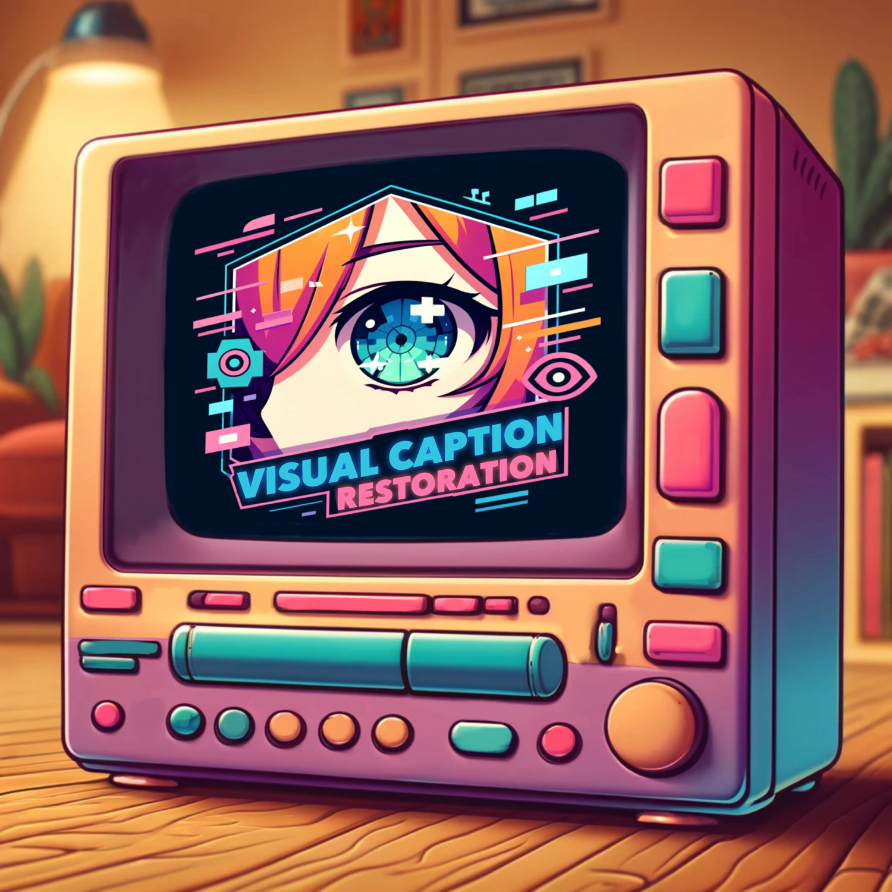

# VCR: Visual Caption Restoration

[Tianyu Zhang†](https://ai.t-zhang.com), [Suyuchen Wang†](https://github.com/sheryc), [Lu Li](https://sites.google.com/view/meetluli/home), [Ge Zhang](https://scholar.google.com/citations?user=qyTrq4kAAAAJ), [Perouz Taslakian](https://perouz.github.io/), [Sai Rajeswar](https://sairajeswar.com/), [Jie Fu](https://bigaidream.github.io/), [Bang Liu](https://www-labs.iro.umontreal.ca/~liubang/), [Yoshua Bengio](https://yoshuabengio.org/)

† Equal contribution

<div align="center">

[](https://arxiv.org/abs/2406.06462)
[](https://huggingface.co/collections/vcr-org/vcr-visual-caption-recognition-6661393b1761e2aff7b967b9)
[](https://huggingface.co/collections/vcr-org/vcr-visual-caption-restoration-smaller-test-subsets-6667b591329b67db9408b493)
</div>

[中文读我文档](README-CN.md)

<div align="center">
  
</div>

# News
- 🔥🔥🔥 **[2024-06-24]** We update our arXiv paper. Now, we have results from Claude 3.5 Sonnet, Claude 3 Opus, GPT-4o, GPT-4-Turbo, Qwen-VL-Max, Reka Core and Gemini-1.5-pro. The evaluation script is also released. Please check `src/evaluation/closed_source_eval.py`.
- 🔥🔥🔥 **[2024-06-15]** We release the VCR transform in torch so that given any image-text pairs, we can generate the VCR images with text embedded in it. This transform can be used as one of the pretrain task within VLMs.
- 🔥🔥🔥 **[2024-06-13]** We release the evaluation codes for open-source models, closed-source models and the pipeline of creating the dataset.
- 🔥🔥🔥 **[2024-06-12]** We have incorperated the VCR-wiki evaluation process in [lmms-eval](https://github.com/EvolvingLMMs-Lab/lmms-eval) framework. Now, users can use one line command to run the evaluation of models on the VCR-wiki test datasets.
- 🔥🔥🔥 **[2024-06-11]** Our paper has been released on the [arXiv](https://arxiv.org/abs/2406.06462), including the evaluation results of a series of models.
- 🔥🔥🔥 **[2024-06-10]** We have released the [VCR-wiki dataset](https://huggingface.co/vcr-org), which contains 2.11M English and 346K Chinese entities sourced from Wikipedia, offered in both easy and hard variants. The dataset is available in the Hugging Face Datasets library.

# Quick Start
```bash
pip install datasets
```
```python
from datasets import load_dataset
# load the English easy mode dataset
dataset = load_dataset("vcr-org/VCR-wiki-en-easy")
# load the English hard mode dataset
dataset = load_dataset("vcr-org/VCR-wiki-en-hard")
# load the Chinese easy mode dataset
dataset = load_dataset("vcr-org/VCR-wiki-zh-easy")
# load the Chinese hard mode dataset
dataset = load_dataset("vcr-org/VCR-wiki-zh-hard")

for obs in dataset['train']: # or 'validation' or 'test'
    # your own code here
```
## Dataset List
|  Dataset   | Download Link |
|  ----  | ----  | 
|  100 Test Subset  | <li>[､要cr-org/VCR-wiki-en-easy-test-100](https://huggingface.co/datasets/vcr-org/VCR-wiki-en-easy-test-100) <li> [､要cr-org/VCR-wiki-en-hard-test-100](https://huggingface.co/datasets/vcr-org/VCR-wiki-en-hard-test-100) <li> [､要cr-org/VCR-wiki-zh-easy-test-100](https://huggingface.co/datasets/vcr-org/VCR-wiki-zh-easy-test-100) <li> [､要cr-org/VCR-wiki-zh-hard-test-100](https://huggingface.co/datasets/vcr-org/VCR-wiki-zh-hard-test-100)|
|  500 Test Subset  | <li>[､要cr-org/VCR-wiki-en-easy-test-500](https://huggingface.co/datasets/vcr-org/VCR-wiki-en-easy-test-500) <li> [､要cr-org/VCR-wiki-en-hard-test-500](https://huggingface.co/datasets/vcr-org/VCR-wiki-en-hard-test-500) <li> [､要cr-org/VCR-wiki-zh-easy-test-500](https://huggingface.co/datasets/vcr-org/VCR-wiki-zh-easy-test-500) <li> [､要cr-org/VCR-wiki-zh-hard-test-500](https://huggingface.co/datasets/vcr-org/VCR-wiki-zh-hard-test-500)|
|  5000 (Full) Test Set   | <li>[､要cr-org/VCR-wiki-en-easy-test](https://huggingface.co/datasets/vcr-org/VCR-wiki-en-easy-test) <li> [､要cr-org/VCR-wiki-en-hard-test](https://huggingface.co/datasets/vcr-org/VCR-wiki-en-hard-test) <li> [､要cr-org/VCR-wiki-zh-easy-test](https://huggingface.co/datasets/vcr-org/VCR-wiki-zh-easy-test) <li> [､要cr-org/VCR-wiki-zh-hard-test](https://huggingface.co/datasets/vcr-org/VCR-wiki-zh-hard-test)|
|  Train Validation Test (Full) Set    | <li>[､要cr-org/VCR-wiki-en-easy](https://huggingface.co/datasets/vcr-org/VCR-wiki-en-easy) <li> [､要cr-org/VCR-wiki-en-hard](https://huggingface.co/datasets/vcr-org/VCR-wiki-en-hard) <li> [､要cr-org/VCR-wiki-zh-easy](https://huggingface.co/datasets/vcr-org/VCR-wiki-zh-easy) <li> [､要cr-org/VCR-wiki-zh-hard](https://huggingface.co/datasets/vcr-org/VCR-wiki-zh-hard)|## Training and Evaluation Datasets

# Introduction
We present VCR-wiki, a dataset designed for the Visual Caption Restoration (VCR) task. 

Please refer to our main figure below for an overview of the VCR task.

<div align="center">
  
</div>


VCR challenges models to restore partially obscured text within images, leveraging pixel-level hints and contextual cues. Unlike traditional text-based tasks, VCR necessitates a synergistic understanding of **visual image (VI)**, **string text (ST)**, and **text embedded in image (TEI)**. Our dataset is crafted using a pipeline that generates synthetic images from image-caption pairs with adjustable caption visibility, allowing for varied difficulty levels. We release the pipeline of creating the dataset here, the code of creating the dataset and the `VCRtransform` as the torch-based transform which can be used in pretraining of VLMs.

<div align="center">
  
</div>


VCR-wiki comprises **2.11M** English and **346K** Chinese entities sourced from Wikipedia, offered in both easy and hard variants. Initial results indicate that current vision-language models fall short compared to human performance on this task.

# Benchmark
EM means `"Exact Match"` and Jaccard means `"Jaccard Similarity"`. The best in closed source and open source are highlighted in **bold**. The second best are highlighted in *italic*. Closed source models are evaluated based on [500 test samples](https://huggingface.co/collections/vcr-org/vcr-visual-caption-restoration-500-test-subsets-6667c9efd77c55f2363b34a1), while open source models are evaluated based on [5000 test samples](https://huggingface.co/collections/vcr-org/vcr-visual-caption-restoration-6661393b1761e2aff7b967b9).
| Model | Size (unknown for closed source) | En Easy EM | En Easy Jaccard | En Hard EM | En Hard Jaccard | Zh Easy EM | Zh Easy Jaccard | Zh Hard EM | Zh Hard Jaccard |
|---|---|---|---|---|---|---|---|---|---|
| Claude 3 Opus | - | 62.0 | 77.67 | 37.8 | 57.68 | 0.9 | 11.5 | 0.3 | 9.22 |
| Claude 3.5 Sonnet | - | 63.85 | 74.65 | 41.74 | 56.15 | 1.0 | 7.54 | 0.2 | 4.0 |
| GPT-4 Turbo | - | *78.74* | *88.54* | *45.15* | *65.72* | 0.2 | 8.42 | 0.0 | *8.58* |
| GPT-4V | - | 52.04 | 65.36 | 25.83 | 44.63 | - | - | - | - |
| GPT-4o | - | **91.55** | **96.44** | **73.2** | **86.17** | **14.87** | **39.05** | **2.2** | **22.72** |
| GPT-4o-mini | - | 83.60 | 87.77 | 54.04 | 73.09 | 1.10 | 5.03 | 0 | 2.02 |
| Gemini 1.5 Pro | - | 62.73 | 77.71 | 28.07 | 51.9 | 1.1 | 11.1 | 0.7 | 11.82 |
| Qwen-VL-Max | - | 76.8 | 85.71 | 41.65 | 61.18 | *6.34* | *13.45* | *0.89* | 5.4 |
| Reka Core | - | 66.46 | 84.23 | 6.71 | 25.84 | 0.0 | 3.43 | 0.0 | 3.35 |
| Cambrian-1 | 34B | 79.69 | 89.27 | *27.20* | 50.04 | 0.03 | 1.27 | 0.00 | 1.37 |
| Cambrian-1 | 13B | 49.35 | 65.11 | 8.37 | 29.12 | - | - | - | - |
| Cambrian-1 | 8B | 71.13 | 83.68 | 13.78 | 35.78 | - | - | - | - |
| CogVLM2 | 19B | *83.25* | *89.75* | **37.98** | **59.99** | 9.15 | 17.12 | 0.08 | 3.67 |
| CogVLM2-Chinese | 19B | 79.90 | 87.42 | 25.13 | 48.76 | **33.24** | **57.57** | **1.34** | **17.35** |
| DeepSeek-VL | 1.3B | 23.04 | 46.84 | 0.16 | 11.89 | 0.0 | 6.56 | 0.0 | 6.46 |
| DeepSeek-VL | 7B | 38.01 | 60.02 | 1.0 | 15.9 | 0.0 | 4.08 | 0.0 | 5.11 |
| DocOwl-1.5-Omni | 8B | 0.84 | 13.34 | 0.04 | 7.76 | 0.0 | 1.14 | 0.0 | 1.37 |
| GLM-4v | 9B | 43.72 | 74.73 | 24.83 | *53.82* | *31.78* | *52.57* | *1.20* | *14.73* |
| Idefics2 | 8B | 15.75 | 31.97 | 0.65 | 9.93 | - | - | - | - |
| InternLM-XComposer2-VL | 7B | 46.64 | 70.99 | 0.7 | 12.51 | 0.27 | 12.32 | 0.07 | 8.97 |
| InternLM-XComposer2-VL-4KHD | 7B | 5.32 | 22.14 | 0.21 | 9.52 | 0.46 | 12.31 | 0.05 | 7.67 |
| InternLM-XComposer2.5-VL | 7B | 41.35 | 63.04 | 0.93 | 13.82 | 0.46 | 12.97 | 0.11 | 10.95 |
| InternVL-V1.5 | 25.5B | 14.65 | 51.42 | 1.99 | 16.73 | 4.78 | 26.43 | 0.03 | 8.46 |
| InternVL-V2 | 26B | 74.51 | 86.74 | 6.18 | 24.52 | 9.02 | 32.50 | 0.05 | 9.49 |
| InternVL-V2 | 40B | **84.67** | **92.64** | 13.10 | 33.64 | 22.09 | 47.62 | 0.48 | 12.57 |
| MiniCPM-V2.5 | 8B | 31.81 | 53.24 | 1.41 | 11.94 | 4.1 | 18.03 | 0.09 | 7.39 |
| Monkey | 7B | 50.66 | 67.6 | 1.96 | 14.02 | 0.62 | 8.34 | 0.12 | 6.36 |
| Qwen-VL | 7B | 49.71 | 69.94 | 2.0 | 15.04 | 0.04 | 1.5 | 0.01 | 1.17 |
| Yi-VL | 34B | 0.82 | 5.59 | 0.07 | 4.31 | 0.0 | 4.44 | 0.0 | 4.12 |
| Yi-VL | 6B | 0.75 | 5.54 | 0.06 | 4.46 | 0.00 | 4.37 | 0.00 | 4.0 |

# Model Evaluation

## Method 1 (recommended): use the evaluation script
### Open-source evaluation
We support open-source model_id: 
```python
["openbmb/MiniCPM-Llama3-V-2_5",
"OpenGVLab/InternVL-Chat-V1-5",
"internlm/internlm-xcomposer2-vl-7b",
"internlm/internlm-xcomposer2-4khd-7b",
"internlm/internlm-xcomposer2d5-7b",
"HuggingFaceM4/idefics2-8b",
"Qwen/Qwen-VL-Chat",
"THUDM/cogvlm2-llama3-chinese-chat-19B",
"THUDM/cogvlm2-llama3-chat-19B",
"echo840/Monkey-Chat",
"THUDM/glm-4v-9b",
"nyu-visionx/cambrian-34b",
"OpenGVLab/InternVL2-26B"]
```
For the models not on list, they are not intergated with huggingface, please refer to their github repo to create the evaluation pipeline. Examples of the inference logic are in `src/evaluation/inference.py`

```bash
pip install -r requirements.txt
# We use HuggingFaceM4/idefics2-8b and vcr_wiki_en_easy as an example
cd src/evaluation
# Evaluate the results and save the evaluation metrics to {model_id}_{difficulty}_{language}_evaluation_result.json
python3 evaluation_pipeline.py --dataset_handler "vcr-org/VCR-wiki-en-easy-test" --model_id HuggingFaceM4/idefics2-8b --output_path . --bootstrap --end_index 5000
```

### Close-source evaluation (using API)
We provide the evaluation script for the close-source models in `src/evaluation/closed_source_eval.py`.

You need an API Key, a pre-saved testing dataset and specify the path of the data saving the paper
```bash
pip install -r requirements.txt
cd src/evaluation
# [download images to inference locally option 1] save the testing dataset to the path using script from huggingface
python3 save_image_from_dataset.py --output_path .
# [download images to inference locally option 2] save the testing dataset to the path using github repo
# use en-easy-test-500 as an example
git clone https://github.com/tianyu-z/VCR-wiki-en-easy-test-500.git

# specify your image path if you would like to inference using the image stored locally by --image_path "path_to_image", otherwise, the script will streaming the images from github repo
python3 closed_source_eval.py --model_id gpt4o --dataset_handler "VCR-wiki-en-easy-test-500" --api_key "Your_API_Key"

# Evaluate the results and save the evaluation metrics to {model_id}_{difficulty}_{language}_evaluation_result.json
python3 evaluation_metrics.py --model_id gpt4o --output_path . --json_filename "gpt4o_en_easy.json" --dataset_handler "vcr-org/VCR-wiki-en-easy-test-500"

# To get the mean score of all the `{model_id}_{difficulty}_{language}_evaluation_result.json` in `jsons_path` (and the std, confidence interval if `--bootstrap`) of the evaluation metrics
python3 gather_results.py --jsons_path .
```

## Method 2: use lmms-eval framework
You may need to incorporate the inference method of your model if the lmms-eval framework does not support it. For details, please refer to [here](https://github.com/EvolvingLMMs-Lab/lmms-eval/blob/main/docs/model_guide.md)
```bash
pip install git+https://github.com/EvolvingLMMs-Lab/lmms-eval.git
# We use HuggingFaceM4/idefics2-8b and vcr_wiki_en_easy as an example
python3 -m accelerate.commands.launch --num_processes=8 -m lmms_eval --model idefics2 --model_args pretrained="HuggingFaceM4/idefics2-8b" --tasks vcr_wiki_en_easy --batch_size 1 --log_samples --log_samples_suffix HuggingFaceM4_idefics2-8b_vcr_wiki_en_easy --output_path ./logs/
```
# Usage of VCR Transform
```python
from vcr_transform import VCRTransform
# the "crossed_text" is optional, when it is None or not provided, VCRTransform will generate the crossed_text automatically.
example = {
    "image": Image.open("assets/main_pic.png"),
    "caption": "Machine learning researchers from around the globe are excited by the new GPU. Even if it is as large as a stovetop, its cutting-edge capabilities enable more efficient and cheaper large-scale experiments.",
    "crossed_text": [
        "learning researchers from around the",
        "cutting-edge capabilities enable more",
    ],
}
# Take the easy mode in English as an example
transform = VCRTransform(mode="easy", language="en") 
transformed_example = transform(example)
```
The full list of arguments for `VCRTransform` initialization is as follows:
* `--mode (str)`: 'easy' or 'hard' or None. If 'easy', the text will be crossed out in the middle of the image. If 'hard', the text will be crossed out in the upper part of the image. If None, the parameters mask_mode, mask_p, n_gram, n_lines, language, font_path, font_size, background_color, output_tensor will be used.
* `--mask_mode (str)`: 'nouns' or 'sentence' or 'percentage' or 'ngram'.
* `--mask_p (float)`: The percentage of words to mask out. Default is 0.5.
* `--n_gram (int)`: The number of subwords to mask out.
* `--n_lines (int)`: The number of lines at most to split the text into. Default is 5.
* `--language (str)`: 'en' or 'zh'.
* `--font_path (str)`: The path to the font file for rendering text on images.
* `--font_size (int)`: The font size for rendering text on images. Default is 20.
* `--background_color (str)`: The background color for rendering text on images. Default is 'white'.
* `--output_tensor (bool)`: Whether to output the image as a tensor. Default is False.

# Dataset Generation

The code for generating a VCR dataset is in `src/dataset`. Before you start, you need:

1. A dataset containing two columns: `image` and `caption`, where `image` contains PIL.Image objects and `caption` is the corresponding caption.
2. A font file for rendering text on images. We used Arial for English and SimSum for Chinese in our experiments.
3. (Optional) A censor word list for initial filtering of harmful entries.

To generate a VCR dataset, you can run the following command:

```bash
cd src/build_dataset
python generate_vcr_dataset.py \
    --dataset_path /path/to/dataset \
    --is_local_dataset True \
    --mask_mode "ngram" \
    --language "en" \
    --font_path /path/to/font \
    --censor_path /path/to/censor \
    --output_dir /path/to/output
```

The full list of arguments for `generate_vcr_dataset.py` is as follows:
* `--dataset_path`: The name or path of the original image-text pair dataset. Need to have "image" and "caption" columns.
* `--is_local_dataset`: Whether the dataset is stored locally. If True, the script will call `datasets.load_from_disk()` to load the dataset.
* `--mask_mode`: The masking mode for generating VCR dataset. One of "nouns", "sentence", "percentage", "ngram". Default is "ngram".
* `--mask_p`: The percentage of words to mask when `mask_mode` is "percentage". Default is 0.5.
* `--n_gram`: The n-gram length when `mask_mode` is "ngram". Default is 5.
* `--n_lines`: The total number of lines of caption to keep in the image. Default is 5.
* `--language`: The language of the dataset. Currently, has to be one of "en" or "zh".
* `--easy_mode`: Whether to generate the easy mode dataset. Default is False.
* `--font_path`: The path to the font file for rendering text on images. You will need to download the font file yourself.
* `--font_size`: The font size for rendering text on images. Default is 20.
* `--background_color`: The background color for rendering text on images. Default is "white".
* `--save_image_examples`: Whether to save example images. Default is False.
* `--save_image_name`: The name of the saved example image. Default is None.
* `--num_examples`: The number of instances in the output dataset. Default is 0 (no limit).
* `--censor_path`: The path to the censor word list for initial dataset filtering. Default is None.
* `--random_seed`: The random seed for dataset generation. Default is 42.
* `--output_dir`: The output directory for the generated VCR dataset. Default is `./data`.

# Citation
If you find VCR useful for your research and applications, please cite using this BibTeX:
```bibtex
@article{zhang2024vcr,
  title   = {VCR: Visual Caption Restoration},
  author  = {Tianyu Zhang and Suyuchen Wang and Lu Li and Ge Zhang and Perouz Taslakian and Sai Rajeswar and Jie Fu and Bang Liu and Yoshua Bengio},
  year    = {2024},
  journal = {arXiv preprint arXiv: 2406.06462}
}
```
