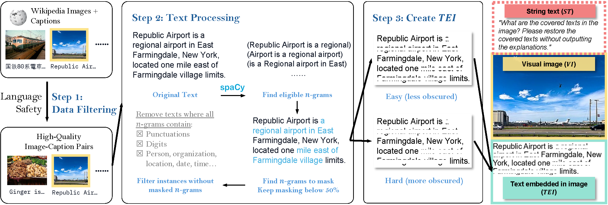

# VCR: Visual Caption Restoration

[Tianyu Zhang†](https://ai.t-zhang.com), [Suyuchen Wang†](https://github.com/sheryc), [Lu Li](https://sites.google.com/view/meetluli/home), [Ge Zhang](https://scholar.google.com/citations?user=qyTrq4kAAAAJ), [Perouz Taslakian](https://perouz.github.io/), [Sai Rajeswar](https://sairajeswar.com/), [Jie Fu](https://bigaidream.github.io/), [Bang Liu](https://www-labs.iro.umontreal.ca/~liubang/), [Yoshua Bengio](https://yoshuabengio.org/)

† Equal contribution

<div align="center">

[](https://arxiv.org/abs/2406.06462)
[](https://huggingface.co/collections/vcr-org/vcr-visual-caption-recognition-6661393b1761e2aff7b967b9)
[](https://huggingface.co/collections/vcr-org/vcr-visual-caption-restoration-smaller-test-subsets-6667b591329b67db9408b493)
</div>

<div align="center">
  
</div>

# Quick Start
```bash
pip install datasets
```
```python
from datasets import load_dataset
# load the English easy mode dataset
dataset = load_dataset("vcr-org/VCR-wiki-en-easy")
# load the English hard mode dataset
dataset = load_dataset("vcr-org/VCR-wiki-en-hard")
# load the Chinese easy mode dataset
dataset = load_dataset("vcr-org/VCR-wiki-zh-easy")
# load the Chinese hard mode dataset
dataset = load_dataset("vcr-org/VCR-wiki-zh-hard")

for obs in dataset['train']: # or 'validation' or 'test'
    # your own code here
```
## Dataset List
|  Dataset   | Download Link |
|  ----  | ----  | 
|  100 Test Subset  | <li>[洟要cr-org/VCR-wiki-en-easy-test-100](https://huggingface.co/datasets/vcr-org/VCR-wiki-en-easy-test-100) <li> [洟要cr-org/VCR-wiki-en-hard-test-100](https://huggingface.co/datasets/vcr-org/VCR-wiki-en-hard-test-100) <li> [洟要cr-org/VCR-wiki-zh-easy-test-100](https://huggingface.co/datasets/vcr-org/VCR-wiki-zh-easy-test-100) <li> [洟要cr-org/VCR-wiki-zh-hard-test-100](https://huggingface.co/datasets/vcr-org/VCR-wiki-zh-hard-test-100)|
|  500 Test Subset  | <li>[洟要cr-org/VCR-wiki-en-easy-test-500](https://huggingface.co/datasets/vcr-org/VCR-wiki-en-easy-test-500) <li> [洟要cr-org/VCR-wiki-en-hard-test-500](https://huggingface.co/datasets/vcr-org/VCR-wiki-en-hard-test-500) <li> [洟要cr-org/VCR-wiki-zh-easy-test-500](https://huggingface.co/datasets/vcr-org/VCR-wiki-zh-easy-test-500) <li> [洟要cr-org/VCR-wiki-zh-hard-test-500](https://huggingface.co/datasets/vcr-org/VCR-wiki-zh-hard-test-500)|
|  5000 (Full) Test Set   | <li>[洟要cr-org/VCR-wiki-en-easy-test](https://huggingface.co/datasets/vcr-org/VCR-wiki-en-easy-test) <li> [洟要cr-org/VCR-wiki-en-hard-test](https://huggingface.co/datasets/vcr-org/VCR-wiki-en-hard-test) <li> [洟要cr-org/VCR-wiki-zh-easy-test](https://huggingface.co/datasets/vcr-org/VCR-wiki-zh-easy-test) <li> [洟要cr-org/VCR-wiki-zh-hard-test](https://huggingface.co/datasets/vcr-org/VCR-wiki-zh-hard-test)|
|  Train Validation Test (Full) Set    | <li>[洟要cr-org/VCR-wiki-en-easy](https://huggingface.co/datasets/vcr-org/VCR-wiki-en-easy) <li> [洟要cr-org/VCR-wiki-en-hard](https://huggingface.co/datasets/vcr-org/VCR-wiki-en-hard) <li> [洟要cr-org/VCR-wiki-zh-easy](https://huggingface.co/datasets/vcr-org/VCR-wiki-zh-easy) <li> [洟要cr-org/VCR-wiki-zh-hard](https://huggingface.co/datasets/vcr-org/VCR-wiki-zh-hard)|## Training and Evaluation Datasets

# Introduction
We present VCR-wiki, a dataset designed for the Visual Caption Restoration (VCR) task. 

Please refer to our main figure below for an overview of the VCR task.

<div align="center">
  
</div>


VCR challenges models to restore partially obscured text within images, leveraging pixel-level hints and contextual cues. Unlike traditional text-based tasks, VCR necessitates a synergistic understanding of **visual image (VI)**, **string text (ST)**, and **text embedded in image (TEI)**. Our dataset is crafted using a pipeline that generates synthetic images from image-caption pairs with adjustable caption visibility, allowing for varied difficulty levels. The show the pipeline of creating the dataset here and we will release the code of creating the dataset soon.

<div align="center">
  
</div>


VCR-wiki comprises **2.11M** English and **346K** Chinese entities sourced from Wikipedia, offered in both easy and hard variants. Initial results indicate that current vision-language models fall short compared to human performance on this task.


# Dataset Generation

The code for generating a VCR dataset is in `src/dataset`. Before you start, you need:

1. A dataset containing two columns: `image` and `caption`, where `image` contains PIL.Image objects and `caption` is the corresponding caption.
2. A font file for rendering text on images. We used Arial for English and SimSum for Chinese in our experiments.
3. (Optional) A censor word list for initial filtering of harmful entries.

To generate a VCR dataset, you can run the following command:

```bash
cd src/dataset
python generate_vcr_dataset.py \
    --dataset_path /path/to/dataset \
    --is_local_dataset True \
    --mask_mode "ngram" \
    --language "en" \
    --font_path /path/to/font \
    --censor_path /path/to/censor \
    --output_dir /path/to/output
```

The full list of arguments for `generate_vcr_dataset.py` is as follows:
* `--dataset_path`: The name or path of the original image-text pair dataset. Need to have "image" and "caption" columns.
* `--is_local_dataset`: Whether the dataset is stored locally. If True, the script will call `datasets.load_from_disk()` to load the dataset.
* `--mask_mode`: The masking mode for generating VCR dataset. One of "nouns", "sentence", "percentage", "ngram". Default is "ngram".
* `--mask_p`: The percentage of words to mask when `mask_mode` is "percentage". Default is 0.5.
* `--n_gram`: The n-gram length when `mask_mode` is "ngram". Default is 5.
* `--n_lines`: The total number of lines of caption to keep in the image. Default is 5.
* `--language`: The language of the dataset. Currently, has to be one of "en" or "zh".
* `--easy_mode`: Whether to generate the easy mode dataset. Default is False.
* `--font_path`: The path to the font file for rendering text on images. You will need to download the font file yourself.
* `--font_size`: The font size for rendering text on images. Default is 20.
* `--background_color`: The background color for rendering text on images. Default is "white".
* `--save_image_examples`: Whether to save example images. Default is False.
* `--save_image_name`: The name of the saved example image. Default is None.
* `--num_examples`: The number of instances in the output dataset. Default is 0 (no limit).
* `--censor_path`: The path to the censor word list for initial dataset filtering. Default is None.
* `--random_seed`: The random seed for dataset generation. Default is 42.
* `--output_dir`: The output directory for the generated VCR dataset. Default is `./data`.

# Citation
If you find VCR useful for your research and applications, please cite using this BibTeX:
```bibtex
@article{zhang2024vcr,
  title   = {VCR: Visual Caption Restoration},
  author  = {Tianyu Zhang and Suyuchen Wang and Lu Li and Ge Zhang and Perouz Taslakian and Sai Rajeswar and Jie Fu and Bang Liu and Yoshua Bengio},
  year    = {2024},
  journal = {arXiv preprint arXiv: 2406.06462}
}
```
